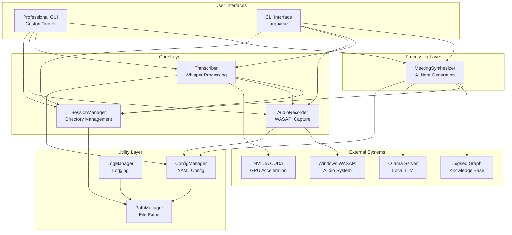
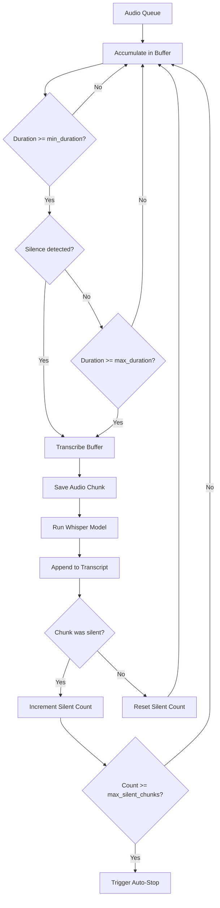
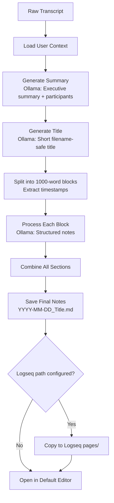
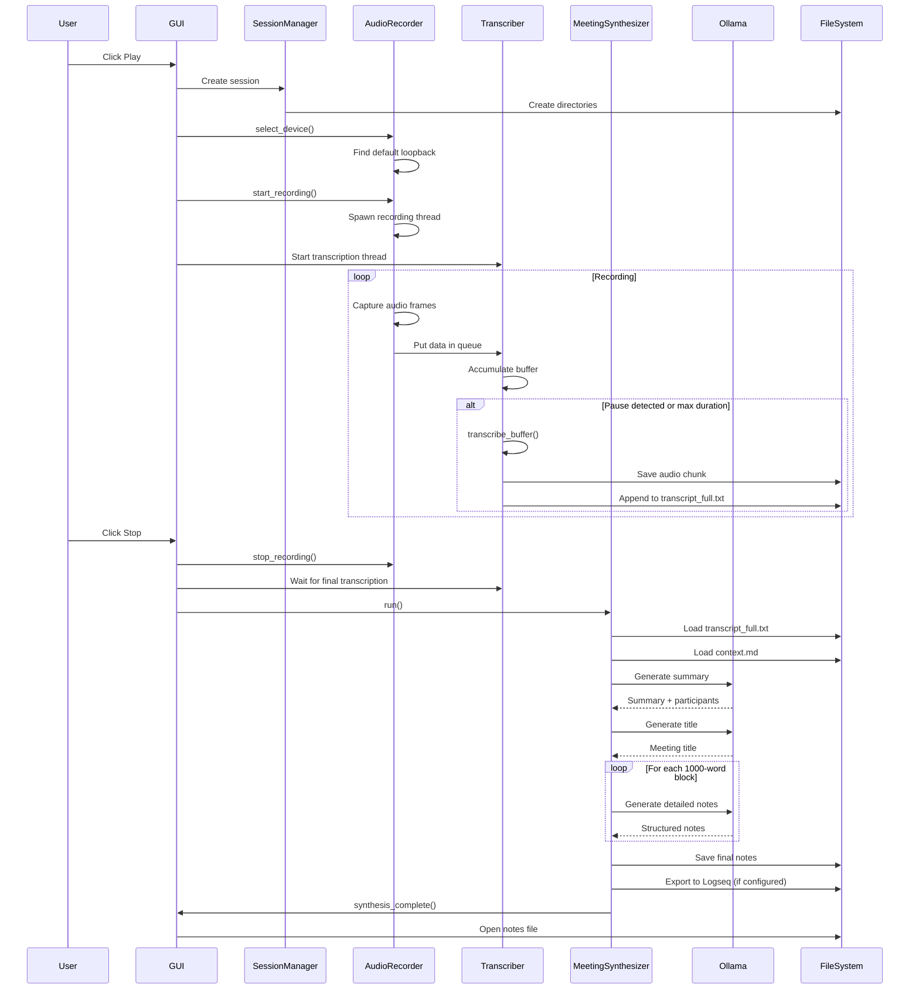

# Scribe Architecture V1.1.0 Documentation

**Version:** 1.1.0  
**Last Updated:** 2025-11-22  
**Purpose:** Comprehensive technical documentation for AI agents working on scribe upgrades

---

## Table of Contents

1. [Overview](#overview)
2. [Purpose & Use Cases](#purpose--use-cases)
3. [Features](#features)
4. [Architecture](#architecture)
5. [Technology Stack](#technology-stack)
6. [Core Components](#core-components)
7. [Data Flow](#data-flow)
8. [Configuration System](#configuration-system)
9. [File Structure](#file-structure)
10. [Development Guidelines](#development-guidelines)

---

## Overview

**Scribe** is a professional real-time audio transcription and meeting synthesis application for Windows. It captures system audio via WASAPI loopback, transcribes it using OpenAI's Whisper model with GPU acceleration, and generates intelligent meeting notes using local Large Language Models (LLMs) through Ollama.

### Key Capabilities

- **Real-time System Audio Capture**: Records any audio playing through the system (meetings, podcasts, videos)
- **GPU-Accelerated Transcription**: Uses faster-whisper with CUDA support for fast, accurate transcription
- **Smart Audio Segmentation**: Automatically detects natural pauses to create coherent transcript chunks
- **AI-Powered Synthesis**: Generates structured meeting notes with summaries, titles, and detailed segments
- **Professional GUI**: Sleek LCD-style interface with waveform visualization and system tray integration
- **Configurable Vocabulary**: Custom jargon support for domain-specific terminology
- **Logseq Integration**: Automatic export to Logseq knowledge base

---

## Purpose & Use Cases

Scribe is designed for professionals who need to capture and document audio content efficiently:

### Primary Use Cases

1. **Meeting Transcription**: Capture Zoom, Teams, or Google Meet conversations with AI-generated summaries
2. **Podcast Notes**: Transcribe and summarize podcast episodes for easy reference
3. **Lecture Recording**: Create organized notes from online lectures and educational content
4. **Interview Processing**: Transcribe interviews with accurate timestamps
5. **Video Summaries**: Generate notes from YouTube videos, tutorials, or webinars

### Target Users

- Remote workers attending virtual meetings
- Researchers conducting interviews
- Students taking online courses
- Content creators consuming educational media
- Knowledge workers building personal knowledge bases

---

## Features

### 🎨 User Interface

#### Professional LCD-Style GUI
- **Compact Design**: 800x50px horizontal bar with minimal screen footprint
- **Cyan Backlit Aesthetic**: Modern, retro-inspired visual design
- **Real-Time Waveform**: 60-bar animated spectrum analyzer showing live audio levels
- **Seven-Segment Timer**: Retro digital display tracking recording duration (HH:MM:SS format)
- **Intuitive Controls**: 
  - Play button (green) - Start recording
  - Pause button (orange) - Pause/resume recording
  - Stop button (red) - Stop and process
  - Settings icon (cog) - Configuration menu
- **System Tray Integration**: 
  - Minimize to tray functionality
  - Recording indicator (green dot on icon)
  - Context menu for quick actions
  - Always visible in taskbar and system tray

#### CLI Mode
- Headless operation for servers or scripted workflows
- Real-time console output of transcription
- Device selection (auto or manual)
- Full feature parity with GUI mode

### 🎙️ Audio Capture

#### System Audio Recording
- **WASAPI Loopback**: Captures all system audio including:
  - Video conferencing applications (Zoom, Teams, Meet)
  - Media players (YouTube, Spotify, podcasts)
  - Desktop applications
- **Automatic Device Selection**: Finds default speaker loopback automatically
- **Manual Device Selection**: Override with specific device if needed
- **Microphone Mixing** (Optional):
  - Simultaneous capture of system audio + microphone
  - Configurable gain levels for each source
  - Fallback to loopback-only if mic unavailable

#### Audio Processing
- **Native Sample Rate Support**: Adapts to device sample rate
- **16kHz Resampling**: Automatic conversion for Whisper model
- **Stereo to Mono Conversion**: Efficient channel mixing
- **Pause/Resume**: Keeps audio stream alive while paused
- **Chunk Archival**: Saves all audio chunks as WAV files for reference

### 📝 Transcription

#### Whisper Integration
- **faster-whisper Library**: Optimized implementation of OpenAI's Whisper
- **GPU Acceleration**: CUDA support for NVIDIA GPUs (automatic fallback to CPU)
- **cuDNN Configuration**: Automatic DLL path setup for Windows
- **Model Selection**: Configurable model size (default: base)

#### Smart Segmentation
- **Pause Detection**: Identifies natural breaks in conversation
- **Duration-Based Chunking**:
  - Minimum duration: 60 seconds (configurable)
  - Maximum duration: 90 seconds (configurable)
  - Prevents cuts mid-sentence
- **Silence Thresholds**:
  - Configurable amplitude threshold for pause detection
  - Adjustable silence window duration
- **Auto-Stop Detection**: Automatically ends recording after prolonged silence

#### Custom Vocabulary
- **Jargon File Support**: Load domain-specific terms from `jargon.txt`
- **Improved Accuracy**: Helps Whisper recognize technical terms, names, acronyms
- **Easy Configuration**: Simple text file format

### 🧠 AI Synthesis

#### Ollama Integration
- **Local LLM Processing**: Uses local Ollama server for privacy
- **Default Model**: qwen3:8b (configurable)
- **No Cloud Dependencies**: All processing happens locally

#### Meeting Synthesis Pipeline

1. **Context Loading**: Reads user-provided context about team, projects, terminology
2. **Transcript Analysis**: Processes full transcript for structure and content
3. **Summary Generation**: Creates executive summary with participant identification
4. **Title Generation**: Generates concise, filename-safe meeting title
5. **Detailed Notes**: Breaks transcript into logical blocks with:
   - Time ranges for each section
   - Key topics and decisions
   - Action items
   - Structured markdown formatting

#### Output Files
- **Final Notes**: `YYYY-MM-DD_Meeting_Title.md` - Primary output with full synthesis
- **Raw Transcript**: `transcript_full.txt` - Complete unprocessed transcription
- **Logseq Export**: `notes_logseq.md` - Formatted for Logseq import
- **Audio Archive**: WAV chunks in `audio_chunks/` directory

### ⚙️ Configuration System

#### YAML Configuration
- **Location**: `Documents/Scribe/config/config.yaml`
- **Auto-Generation**: Creates default config on first run
- **Hot Reload**: Changes take effect on next session
- **Sections**:
  - **audio**: Microphone mixing settings
  - **transcription**: Pause detection and chunking parameters
  - **synthesis**: LLM model selection and Logseq path

#### Jargon Configuration
- **Location**: `Documents/Scribe/config/jargon.txt`
- **Format**: One term per line
- **Usage**: Loaded into Whisper as initial prompt

#### Context Configuration
- **Location**: `Documents/Scribe/config/context.md`
- **Format**: Free-form markdown
- **Content Suggestions**:
  - Team member names and roles
  - Current project descriptions
  - Acronym definitions
  - Meeting goals and preferences

---

## Architecture

Scribe follows a modular, event-driven architecture with clear separation of concerns.



### Architecture Principles

1. **Separation of Concerns**: Each module has a single, well-defined responsibility
2. **Thread Safety**: Uses queues for inter-thread communication
3. **Daemon Threads**: Audio processing runs in background threads
4. **Configuration Over Code**: Behavior controlled via YAML config
5. **Graceful Degradation**: Automatic fallbacks (GPU→CPU, mic unavailable)
6. **User Data Isolation**: All user data in `Documents/Scribe/`

---

## Technology Stack

### Core Technologies

| Category | Technology | Purpose |
|----------|-----------|---------|
| **Language** | Python 3.12+ | Primary development language |
| **Package Manager** | uv | Fast Python package manager |
| **Audio Capture** | soundcard 0.4.2+ | WASAPI loopback and microphone access |
| **Transcription** | faster-whisper 1.2.1+ | Optimized Whisper implementation |
| **GPU Acceleration** | CUDA 12 / cuDNN 9.0+ | NVIDIA GPU support |
| **GUI Framework** | CustomTkinter 5.2.2+ | Modern tkinter-based UI |
| **System Tray** | pystray 0.19.5+ | System tray integration |
| **LLM Integration** | Ollama (via requests) | Local AI model inference |
| **Configuration** | PyYAML 6.0+ | YAML parsing |
| **Math/Signal** | numpy <2.0, scipy 1.10+ | Audio processing |
| **Audio I/O** | soundfile 0.13.1+ | WAV file reading/writing |

### Dependencies

```toml
[project.dependencies]
colorama>=0.4.6           # Terminal colors
faster-whisper>=1.2.1     # Whisper transcription
numpy<2.0                 # Array operations
nvidia-cudnn-cu12>=9.0.0  # CUDA Deep Neural Network library
soundcard>=0.4.2          # Audio I/O
scipy>=1.10.0             # Signal processing
soundfile>=0.13.1         # Audio file I/O
tqdm>=4.67.1              # Progress bars
requests>=2.32.3          # HTTP client for Ollama
customtkinter>=5.2.2      # GUI framework
pystray>=0.19.5           # System tray
pillow>=12.0.0            # Image processing
PyYAML>=6.0               # Configuration
psutil>=5.9.0             # Process utilities
```

### External Systems

- **Ollama**: Local LLM server (qwen3:8b default model)
- **Logseq** (Optional): Knowledge base for note export
- **Windows WASAPI**: Low-level audio API
- **NVIDIA CUDA/cuDNN**: GPU acceleration libraries

---

## Core Components

### 1. SessionManager

**Location**: `src/scribe/core/session.py`  
**Responsibility**: Creates and manages recording session directories and file paths

#### Key Features
- Generates unique session IDs (timestamp-based: `YYYY-MM-DD_HH-MM-SS`)
- Creates session directory structure
- Provides paths for audio chunks, transcripts, and notes
- Integrates with logging system

#### API
```python
class SessionManager:
    def __init__(self):
        self.session_id: str
        self.base_dir: str
        self.audio_dir: str
        self.transcript_raw: str
        self.transcript_logseq: str
```

#### Directory Structure Created
```
Documents/Scribe/sessions/<session_id>/
├── audio_chunks/
├── transcript_full.txt
└── notes_logseq.md
```

---

### 2. AudioRecorder

**Location**: `src/scribe/core/recorder.py`  
**Responsibility**: Captures system audio (and optionally microphone) using WASAPI loopback

#### Key Features
- Automatic default speaker loopback detection
- Manual device selection mode
- Microphone mixing with configurable gains
- Pause/resume without closing audio stream
- Thread-safe queue-based data flow
- Mono conversion and sample rate handling

#### Architecture
```python
class AudioRecorder:
    def __init__(self, mix_mic, mic_device, mic_gain, loopback_gain):
        self.q: queue.Queue              # Output queue for audio data
        self.target_sample_rate: int     # 16000 for Whisper
        self.native_sample_rate: int     # Device's native rate
        self.recording: bool             # Recording state
        self.paused: bool                # Pause state
        
    def select_device(self, manual_mode: bool)
    def record_loop(self)                # Runs in background thread
    def start_recording(self)
    def stop_recording(self)
    def pause(self)
    def resume(self)
```

#### Data Flow
1. Selects loopback device (default speaker output)
2. Optionally opens microphone for mixing
3. Spawns background thread running `record_loop()`
4. Continuously reads audio frames from devices
5. Converts stereo to mono, applies gains
6. Puts audio data into thread-safe queue
7. Transcriber consumes from queue

---

### 3. Transcriber

**Location**: `src/scribe/core/transcriber.py`  
**Responsibility**: Processes audio queue, performs Whisper transcription with smart segmentation

#### Key Features
- CUDA-first GPU acceleration with CPU fallback
- Smart pause detection for natural chunking
- Configurable min/max chunk durations
- Automatic silence-based recording termination
- Custom jargon/vocabulary support
- Real-time console output
- Audio chunk archival

#### Architecture
```python
class Transcriber:
    def __init__(self, recorder_queue, native_sample_rate, session_manager, auto_stop_callback):
        self.queue: queue.Queue          # From AudioRecorder
        self.buffer: list                # Accumulates audio frames
        self.model: WhisperModel         # faster-whisper instance
        self.jargon_text: str           # Custom vocabulary
        
    def load_model(self)                 # Loads Whisper with CUDA/CPU
    def load_jargon(self)               # Loads custom vocabulary
    def process_audio(self)              # Main loop (runs in thread)
    def transcribe_buffer(self)          # Transcribes accumulated buffer
    def save_audio_chunk(self, audio_data)  # Archives WAV files
```

#### Smart Segmentation Algorithm

The transcriber uses a sophisticated multi-level segmentation strategy:

**Level 1: Pause Detection (Natural Breaks)**
- Monitors last `silence_duration` seconds of audio (default: 0.5s)
- If amplitude below `silence_threshold` (default: 0.01), considers it a pause
- Only triggers after `min_duration` (default: 60s)
- Forces chunk at `max_duration` (default: 90s) regardless of pauses

**Level 2: Auto-Stop Detection (End of Recording)**
- Separate threshold: `silence_chunk_threshold` (default: 0.005)
- Counts consecutive silent chunks
- Stops recording after `max_silent_chunks` (default: 1)

```python
# Configuration Parameters
transcription:
  min_duration: 60              # Min seconds before natural pause cut
  max_duration: 90              # Force cut at this duration
  silence_threshold: 0.01       # Amplitude for pause detection
  silence_duration: 0.5         # Window to check for silence
  max_silent_chunks: 1          # Auto-stop after N silent chunks
  silence_chunk_threshold: 0.005  # Amplitude for auto-stop
```

#### Transcription Pipeline



---

### 4. MeetingSynthesizer

**Location**: `src/scribe/synthesis.py`  
**Responsibility**: Post-processes transcripts using AI to generate structured meeting notes

#### Key Features
- Context-aware synthesis using user-provided context
- Multi-stage processing pipeline
- Block-based processing for long transcripts (1000 words/block)
- Timestamp extraction and preservation
- Automatic file naming based on content
- Logseq export with proper formatting

#### Architecture
```python
class MeetingSynthesizer:
    def __init__(self, session_dir):
        self.session_dir: str
        self.transcript_file: str
        self.ollama_url: str         # Default: http://localhost:11434
        self.model: str              # From config, default: qwen3:8b
        self.context: str            # User-provided context
        
    def load_context(self)           # Loads context.md
    def read_transcript(self)        # Loads transcript_full.txt
    def split_into_blocks_with_timestamps(self, text, words_per_block)
    def generate_summary(self, transcript)  # Executive summary
    def generate_meeting_title(self, summary)  # Filename-safe title
    def generate_detailed_notes(self, block, block_num, time_range)
    def export_to_logseq(self, final_file_path)
    def run(self)                    # Execute full pipeline
```

#### Synthesis Pipeline



#### Prompts Used

The synthesizer uses carefully crafted prompts for each stage:

**Summary Prompt**:
- Input: Full transcript + user context
- Output: Executive summary + participant list
- Temperature: 0.7 (creative but focused)

**Title Prompt**:
- Input: Generated summary
- Output: 3-5 word descriptive title
- Constraints: No special characters, spaces replaced with underscores

**Detailed Notes Prompt**:
- Input: Transcript block + time range + context
- Output: Structured markdown with:
  - Key topics discussed
  - Decisions made
  - Action items
  - Relevant quotes
  - Logical subsections

---

### 5. ConfigManager

**Location**: `src/scribe/utils/config.py`  
**Responsibility**: Manages application configuration via YAML

#### Key Features
- Default configuration embedded in code
- User config merging with defaults
- Type-safe config access
- Auto-creation of config file
- Deep merge for nested dictionaries

#### Default Configuration
```yaml
audio:
  mix_mic: false
  mic_device: null
  mic_gain: 1.0
  loopback_gain: 1.0

transcription:
  min_duration: 60
  max_duration: 90
  silence_threshold: 0.01
  silence_duration: 0.5
  max_silent_chunks: 1
  silence_chunk_threshold: 0.005

synthesis:
  ollama_model: "qwen3:8b"
  logseq_graph_path: ""
```

---

### 6. Professional GUI (ScribeProGUI)

**Location**: `src/scribe/gui/app_pro.py`  
**Responsibility**: Provides professional LCD-style graphical interface

#### Key Features
- **Compact LCD Bar Design**: 800x50px horizontal window
- **Real-Time Waveform**: 60-bar spectrum visualization
- **Seven-Segment Timer**: Digital clock display (HH:MM:SS)
- **Media Controls**: Play, pause, stop with icon generation
- **Settings Menu**: Access to config files
- **System Tray Integration**: 
  - Minimize to tray
  - Recording indicator (green dot)
  - Context menu
- **Progress Tracking**: Progress bar during AI synthesis
- **Auto-Open Notes**: Opens generated notes on completion

#### State Management
```python
self.state = "idle"  # idle, recording, paused, processing
```

State transitions:
- `idle` → `recording`: Click play
- `recording` → `paused`: Click pause
- `paused` → `recording`: Click pause again
- `recording` → `processing`: Click stop (or auto-stop)
- `processing` → `idle`: Synthesis complete

#### Thread Safety
- GUI runs on main thread
- Audio recording in background thread
- Transcription in background thread
- Synthesis in background thread
- Uses CustomTkinter's `after()` for UI updates from threads

---

## Data Flow

### End-to-End Recording Session



---

## Configuration System

### Configuration Files

Scribe uses a three-tier configuration system:

#### 1. Application Config (`config.yaml`)

**Location**: `Documents/Scribe/config/config.yaml`

**Structure**:
```yaml
audio:
  mix_mic: false              # Enable mic+loopback mixing
  mic_device: null            # Specific mic name (null = default)
  mic_gain: 1.0               # Microphone volume multiplier
  loopback_gain: 1.0          # System audio volume multiplier

transcription:
  min_duration: 60            # Min seconds before allowing pause-based cut
  max_duration: 90            # Force cut at this many seconds
  silence_threshold: 0.01     # Amplitude threshold for pause (lower = more sensitive)
  silence_duration: 0.5       # Seconds of silence required to trigger pause
  max_silent_chunks: 1        # Number of silent chunks before auto-stop
  silence_chunk_threshold: 0.005  # Amplitude threshold for auto-stop detection

synthesis:
  ollama_model: "qwen3:8b"    # LLM model to use (must be pulled in Ollama)
  logseq_graph_path: ""       # Path to Logseq pages folder (empty = disabled)
```

**Access Pattern**:
```python
config_manager = ConfigManager()
min_duration = config_manager.config.get("transcription", {}).get("min_duration", 60)
```

#### 2. Jargon File (`jargon.txt`)

**Location**: `Documents/Scribe/config/jargon.txt`

**Format**: Plain text, one term per line

**Example**:
```
API
Kubernetes
GraphQL
PostgreSQL
JWT
OAuth
```

**Usage**: Loaded as Whisper initial prompt to improve recognition of technical terms

#### 3. Context File (`context.md`)

**Location**: `Documents/Scribe/config/context.md`

**Format**: Free-form markdown

**Purpose**: Provides background information to AI for better synthesis

**Example Content**:
```markdown
# Team Information
- **John Doe** - Engineering Manager
- **Jane Smith** - Senior Developer
- **Bob Johnson** - Product Manager

# Current Projects
- **Project Phoenix** - Migration to microservices architecture
- **Project Atlas** - New customer dashboard

# Common Acronyms
- **SLA**: Service Level Agreement
- **KPI**: Key Performance Indicator
- **ETA**: Estimated Time of Arrival
```

### Configuration Override Hierarchy

1. **CLI Arguments** (highest priority)
   - Example: `scribe record --mix-mic --mic-gain 1.5`
2. **config.yaml** (user overrides)
3. **Default Config** (embedded in ConfigManager)

---

## File Structure

### Repository Layout

```
scribe/
├── .git/                          # Git repository
├── .venv/                         # Virtual environment
├── .python-version                # Python version (3.12)
├── .gitignore                     # Git ignore rules
│
├── src/scribe/                    # Main package
│   ├── __init__.py               # Package init
│   ├── cli.py                    # CLI entry point (main command)
│   │
│   ├── core/                     # Core functionality (modular)
│   │   ├── __init__.py          # CUDA setup, class exports
│   │   ├── session.py           # SessionManager
│   │   ├── recorder.py          # AudioRecorder
│   │   └── transcriber.py       # Transcriber
│   │
│   ├── gui/                      # GUI components
│   │   ├── __init__.py
│   │   └── app_pro.py           # Professional GUI implementation
│   │
│   ├── utils/                    # Utility modules
│   │   ├── __init__.py
│   │   ├── config.py            # ConfigManager
│   │   ├── paths.py             # Path utilities
│   │   ├── logging.py           # Logging setup
│   │   └── instance.py          # Single-instance locking
│   │
│   └── synthesis.py              # MeetingSynthesizer
│
├── config/                        # Default config templates
│   ├── jargon.txt                # Example jargon file
│   └── context_template.md       # Example context file
│
├── docs/                          # Documentation
│   ├── ARCHITECTURE.md           # This file
│   └── mic_system_audio_mixing_plan.md
│
├── scripts/                       # Launcher scripts
│   └── [launcher scripts]
│
├── pyproject.toml                 # Project metadata & dependencies
├── uv.lock                        # Locked dependencies
├── README.md                      # User documentation
├── AGENTS.md                      # AI agent development guide
├── LICENSE                        # MIT license
└── favicon.ico                    # Application icon
```

### User Data Directory

**Location**: `C:\Users\<username>\Documents\Scribe\`

```
Documents/Scribe/
├── config/
│   ├── config.yaml               # User configuration
│   ├── jargon.txt                # Custom vocabulary
│   └── context.md                # User context for AI
│
├── logs/
│   └── scribe_YYYY-MM-DD.log     # Daily log files
│
└── sessions/
    └── YYYY-MM-DD_HH-MM-SS/      # Each recording session
        ├── audio_chunks/
        │   ├── chunk_001.wav
        │   ├── chunk_002.wav
        │   └── ...
        │
        ├── transcript_full.txt    # Raw transcription
        ├── notes_logseq.md        # Logseq export
        └── YYYY-MM-DD_Meeting_Title.md  # Final synthesized notes
```

### Output File Formats

#### 1. Raw Transcript (`transcript_full.txt`)

**Format**: Plain text with timestamps

**Example**:
```
[00:01:23]
Welcome everyone to today's sprint planning meeting. Today we'll be discussing the priorities for the next two weeks...

[00:03:45]
John, can you give us an update on the API refactoring work?
```

#### 2. Final Notes (`YYYY-MM-DD_Meeting_Title.md`)

**Format**: Structured markdown

**Structure**:
```markdown
# Meeting Title

**Date**: YYYY-MM-DD  
**Duration**: [Start Time] - [End Time]

## Summary

[Executive summary paragraph]

## Participants

- Person 1
- Person 2

## Topics Discussed

### Topic 1 [HH:MM:SS - HH:MM:SS]

- Key point 1
- Key point 2
- **Decision**: [Decision made]
- **Action Item**: [Who] to [what] by [when]

### Topic 2 [HH:MM:SS - HH:MM:SS]

...
```

#### 3. Logseq Export (`notes_logseq.md`)

**Format**: Logseq-compatible markdown with page references

---

## Development Guidelines

### Critical Principles

#### 1. File Size and Modularity

**AVOID**: Monolithic files with multiple classes
**PREFER**: Small, focused files (typically <300 lines)

The original `core.py` was 375+ lines and caused editing errors. Refactored into:
- `core/session.py` (45 lines)
- `core/recorder.py` (118 lines)
- `core/transcriber.py` (229 lines)

#### 2. CUDA Setup Requirement

**CRITICAL**: CUDA DLLs must be added to PATH **before** importing `ctranslate2` or `faster_whisper`.

This is why `core/__init__.py` exists:
```python
# core/__init__.py
import os


import sys
from pathlib import Path

# CUDA DLL path setup MUST happen before faster_whisper import
def _setup_cuda_path():
    """Add CUDA DLLs to PATH before loading CTranslate2."""
    venv_path = Path(sys.executable).parent.parent
    cudnn_path = venv_path / "Lib" / "site-packages" / "nvidia" / "cudnn" / "bin"
    # ... (adds to PATH)

_setup_cuda_path()

# Now safe to import classes that use faster_whisper
from scribe.core.session import SessionManager
from scribe.core.recorder import AudioRecorder
from scribe.core.transcriber import Transcriber
```

**DO NOT** move or remove this setup code.

#### 3. Thread Safety

**Pattern**: Use `queue.Queue` for inter-thread communication
**Pattern**: Mark processing threads as `daemon=True`
**Pattern**: Use locks for shared state

Example:
```python
# AudioRecorder puts data in queue
self.q.put(audio_data)

# Transcriber consumes from queue
while self.recording:
    data = self.queue.get(timeout=0.5)
    # process data...
```

#### 4. Configuration Usage

**AVOID**: Hardcoded values
**PREFER**: ConfigManager access

```python
# Bad
if duration > 90:  # Hardcoded

# Good
if duration > self.max_duration:  # From config
```

### Testing Workflow

#### Quick Import Test
```bash
uv run python -c "from scribe.core import SessionManager, AudioRecorder, Transcriber; print('✅ OK')"
```

#### CLI Recording Test
```bash
uv run scribe record
# Play audio for 10-15 seconds
# Ctrl+C to stop
# Check Documents/Scribe/sessions/ for output
```

#### GUI Test
```bash
uv run scribe gui
# Click play → record → stop
# Verify transcript and synthesis
```

### Development Best Practices

1. **View before edit**: Always view exact lines before modifying
2. **Small, focused edits**: One logical change per edit operation
3. **Verify imports**: Check imports after adding new dependencies
4. **Test immediately**: Run verification after each significant change
5. **Use git checkout**: Restore corrupted files and start over
6. **Update documentation**: Keep README.md and AGENTS.md synchronized
7. **Increment version**: Follow semantic versioning in `pyproject.toml`

### Common Pitfalls

❌ **Don't**: Edit large sections blindly with `multi_replace_file_content`  
✅ **Do**: Make focused changes with proper context

❌ **Don't**: Assume config values  
✅ **Do**: Use `ConfigManager.get()` pattern

❌ **Don't**: Forget daemon threads  
✅ **Do**: Always use `daemon=True` for background threads

❌ **Don't**: Remove CUDA setup code  
✅ **Do**: Preserve `core/__init__.py` structure

---

## Future Enhancement Considerations

### Potential Upgrade Areas

1. **Multi-Platform Support**
   - macOS audio capture (replace WASAPI with CoreAudio)
   - Linux audio capture (PulseAudio/ALSA)

2. **Enhanced AI Features**
   - Speaker diarization (who said what)
   - Sentiment analysis
   - Topic modeling
   - Automatic meeting type classification

3. **Cloud Integration**
   - Cloud storage sync (Dropbox, Google Drive)
   - Shared team notes
   - Collaboration features

4. **Advanced Audio Processing**
   - Noise reduction
   - Echo cancellation
   - Multi-channel support

5. **Extended Export Options**
   - Notion export
   - Obsidian export
   - PDF generation
   - Google Docs integration

6. **Real-Time Features**
   - Live transcription display in GUI
   - Real-time note-taking assistance
   - Meeting highlights as they happen

7. **Analytics & Insights**
   - Meeting statistics (duration, participant talk time)
   - Topic frequency analysis
   - Action item tracking dashboard

8. **Customization**
   - Theming system for GUI
   - Custom synthesis templates
   - Pluggable LLM backends (OpenAI, Anthropic, etc.)

### Constraints to Consider

- **Windows-Only**: WASAPI is Windows-specific
- **Local Processing**: Ollama must be running locally
- **GPU Dependency**: CUDA requires NVIDIA GPU (CPU fallback available)
- **Python 3.12+**: Uses modern Python features
- **Ollama Model Size**: qwen3:8b requires ~5GB RAM

---

## License

MIT License - See LICENSE file for details

---

## Credits

Built with:
- [faster-whisper](https://github.com/guillaumekln/faster-whisper) - Efficient Whisper implementation
- [customtkinter](https://github.com/TomSchimansky/CustomTkinter) - Modern UI framework
- [soundcard](https://github.com/bastibe/SoundCard) - Cross-platform audio I/O
- [pystray](https://github.com/moses-palmer/pystray) - System tray integration
- [Ollama](https://ollama.com/) - Local LLM inference

---

**Last Revision**: 2025-11-22  
**Maintained by**: Scribe Development Team
